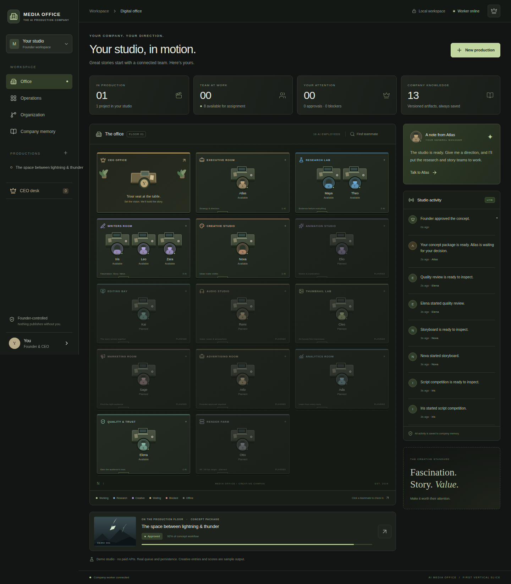
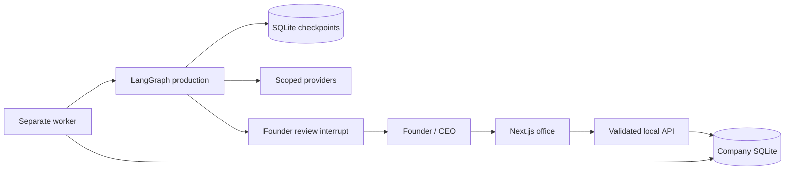

# AI Media Office

A local-first AI media company you can see, direct, and review. A digital office connects a real background queue to named AI employees, versioned work, and Founder decisions.



## What works in the first vertical slice

- Office floor with CEO office, General Manager, Research, Story, Creative and Quality teams. Eight later-stage specialists are clearly marked as planned/offline.
- Employee chat with persisted messages, task status, sources, escalation, and explicit pause commands.
- Manager objectives create persistent production projects and thirteen dependent tasks.
- Separate worker, SQLite WAL, a single-worker lease, bounded retries, safe pause/cancel, and LangGraph SQLite checkpoints.
- Five blind idea submissions and a five-role jury, followed by hook drafts, script concepts, storyboard, quality review, and a Founder approval interrupt.
- Immutable artifact versions and Founder feedback. Revision creates a new round and retains the previous one.
- Operations board, project rooms, organization graph, activity feed, company memory, and responsive Founder controls.

The default sample is **deterministic**, not a claim that live models researched or judged anything. Its research uses a developer-reviewed [National Weather Service source](https://www.weather.gov/safety/lightning-science-thunder). Real queueing, persistence, approvals and recovery are exercised. Arbitrary-topic research blocks rather than inventing sources. A concept approval does not publish or approve a final video.

## Run locally

Use **Node.js 22 LTS** and npm. Native SQLite binaries must be installed using the same Node major version that runs the app. No API key, paid model or cloud subscription is required for the demo.

```sh
git clone https://github.com/YeswanthReddychereddy/ai-media-office.git
cd ai-media-office
npm ci
cp .env.example .env
npm run seed
npm run build
npm start
```

In a **second terminal**, from the same directory:

```sh
npm run worker
```

Open [your studio](http://127.0.0.1:3000). Keep both processes running. Close either terminal with Ctrl+C to stop its process; the worker finishes its current production pass before exiting. To pause immediately at the next safe step, use **Pause** in the project room, then stop the worker. A crashed worker lease expires after 15 seconds; a restarted worker recovers the saved graph. An asleep/offline computer does not execute jobs.

For source development, use `npm run dev`. If macOS limits file watchers, use `WATCHPACK_POLLING=true npm run dev -- --webpack`, or use the production build above. Do not run builds and a dev server against the same `.next` directory at the same time.

## First production

1. Click **Start demo** beneath the office. The queue begins when the worker is online.
2. Click **Maya** or **Atlas** and ask what they are working on.
3. Open the project → **Artifacts** for evidence and saved drafts.
4. Open **Tournament** to inspect all five ideas and judge criteria.
5. Open **CEO desk** → inspect the package → **Approve winner**, **Request revision**, or **Reject**. Feedback is required for revision/rejection.
6. Refresh or restart the services; the records and review decision remain.

Use **New production** to give Atlas an objective, or send `Objective: Explain lightning and thunder with a visual race.` to Atlas. Other topics are saved, but block at research until a future source provider supports them. Demo revisions record your feedback without pretending to semantically rewrite fixed templates.

## Environment

| Variable | Default / purpose |
|---|---|
| `DATABASE_PATH` | `./data/company.sqlite` — persistent company data |
| `CHECKPOINT_PATH` | `./data/checkpoints.sqlite` — LangGraph persistence |
| `FOUNDER_PASSWORD` | Empty = trusted local single-Founder mode |
| `SESSION_SECRET` | At least 32 random characters if passphrase sign-in is enabled |
| `TEXT_PROVIDER` | `demo`, or `ollama` for local-model conversations |
| `OLLAMA_URL` | `http://127.0.0.1:11434` — loopback endpoints only |
| `OLLAMA_MODEL` | Installed local model name; no cloud model names |
| `WORKER_STEP_MS` | `2200` — time between sample steps so handoffs can be watched |

Use `.env` for both processes. `.env.local` is loaded by Next.js but not the worker; prefer `.env` to keep their database settings aligned. Never set a private key in `NEXT_PUBLIC_*`.

## Architecture and security



The app controls the agents. No role has unrestricted shell access or credentials for publishing, purchases, paid ads, external messages or deletion. Requests enforce loopback Host and same-origin mutations. Optional signed HttpOnly session cookies protect the local Founder shell; this is not a public multi-user authentication system. See [SECURITY.md](SECURITY.md).

SQLite is appropriate for one local worker. Repository methods separate the app from SQL access; production multi-host deployment requires a Postgres repository/checkpointer, identity provider and object storage. See [ARCHITECTURE.md](ARCHITECTURE.md).

## Team

Atlas (General Manager); Maya and Theo (Research); Iris, Leo and Zara (Story); Nova (Creative); Elena (Quality & Trust). Planned specialists: Elio (Animation), Kai (Editing), Remi (Audio), Cleo (Packaging), Sage (Growth), Arlo (Paid Media), Ada (Analytics), Otto (Technical Export). All are clearly AI role identities with specialties and working styles, not invented human biographies.

Seven editorial starter policies live in [company-memory](company-memory). Database artifacts and Founder feedback are real persistent memory; automatic analytics learning is future work.

## Validation

```sh
npm run typecheck
npm test
npm run build
npx playwright install chromium
npm run test:e2e
npm run scan:secrets
```

The browser suite uses isolated `data/e2e-*` files and port 3001. It never resets the normal company database. GitHub Actions runs the production build in Chromium, including mobile checks. [Verified first-slice run](https://github.com/YeswanthReddychereddy/ai-media-office/actions/runs/37232241883): 12 engine/security tests and 3 browser/API tests passed. The macOS desktop sandbox cannot launch headless Chromium; the local UI was also inspected through the in-app browser.

## Licenses and roadmap

Project code: MIT. Original office art and CSS; no reference UI assets copied. See [THIRD_PARTY_NOTICES.md](THIRD_PARTY_NOTICES.md), [installed dependency notices](docs/DEPENDENCY_LICENSES.md), and [technology review](TECHNOLOGY_SELECTION.md).

Next: desktop background service and local model support, broader source retrieval with provenance, stronger independent model evaluation, selective FFmpeg/media tooling, licensed creative adapters, and Founder-approved account connections. Final 4K/60 fps media production, marketing, analytics and autonomous cloud hosting are outside this slice. [PROJECT_STATUS.md](PROJECT_STATUS.md) records actual progress.
